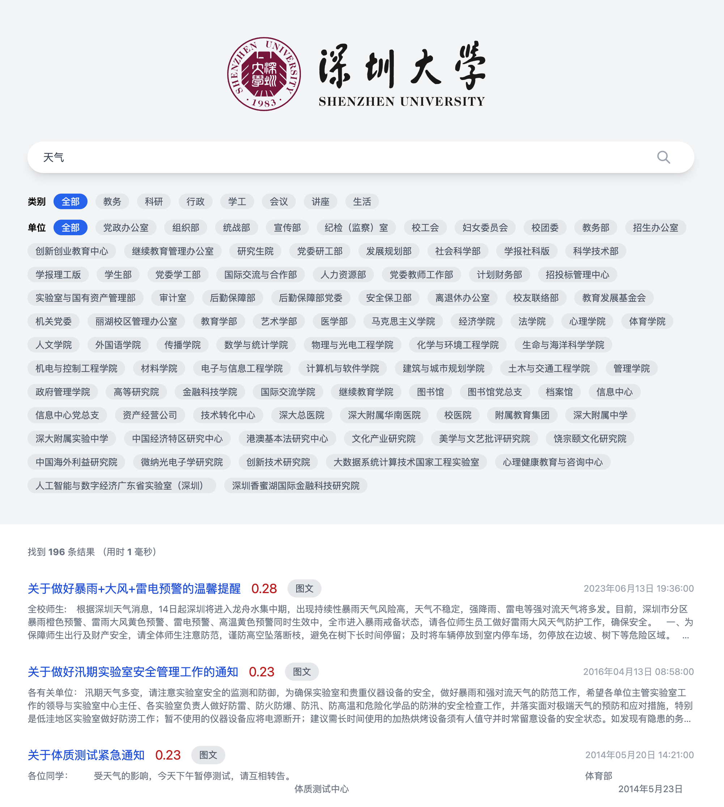

# 信息检索大作业

## 截图



## 项目介绍

### 爬虫 (NodeJS, TypeScript)

能够爬取深大公文通的文章，保存为 JSON 文件，放在 `dataset` 文件夹下

### 核心程序 (Rust)

- 使用 `serde_json` 读取 JSON 数据
- 使用 `sprs` 稀疏矩阵处理数据
- 使用`jieba-rs` 中文分词、 `rust-stemmers` 英文词干提取
- 构建倒排索引
- 使用 TF-IDF 算法计算权重
- 基于文档和搜索的余弦相似度进行排序
- 使用 `axum` 建立 Web 服务 API，serve 前端

### 前端 (Vue3 + Tailwindcss)

位于 `public` 文件夹下

直接用 cdn 的方式引用了 `vue3` 和 `tailwindcss`

纯静态的，且无需构建，核心程序直接 serve 这个文件夹

## 运行方法

### 爬取深大公文通的文章

先在 `crawler/index.ts` 中填写深大内部网 cookie，然后在 `crawler` 文件夹运行

```bash
pnpm install
pnpm run start
```

数据将会保存在 `dataset` 文件夹下

### 运行核心程序

在 `.` 下运行

```bash
cargo run --release
```

然后浏览器打开 `http://localhost:3000` 即可
